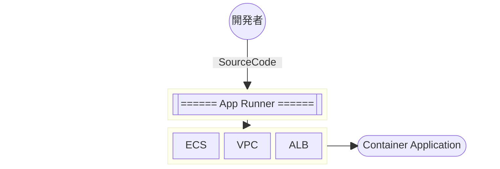
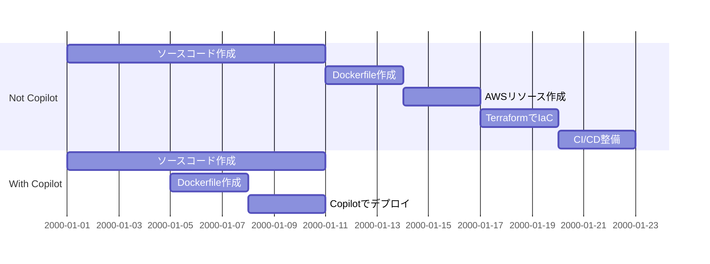

# AWS Copilot

---

# What is AWS Copilot ?

copilotと言えば、生成AI?

AWS上でのコンテナアプリケーションの実行・管理を素早く簡単に行うことができるCLIツール

https://aws.amazon.com/jp/containers/copilot/


---

# Container Application on AWS

そもそも、どういう選択肢があるの？

- Docker on EC2

<Underline>→ できなくはないが限りなくナシ</Underline>

- Lambda（コンテナランタイム）

<Underline>→ アプリケーションというより関数</Underline>

- ECS
- EKS
- App Runner

<Underline :isImportant=true>→ マネージドな選択肢ならこのどれか</Underline>

---

# ECS vs EKS

## ECS

AWSの提供するコンテナオーケストレーションサービス。  
EKSと役割はほぼ同じだが、AWS環境に限定される。  
用語がKubernetesと違う。  
ex. 「タスク」＝Pod、「サービス」＝Deployment / Service

## EKS

コンテナというよりKubernetes。  
KubernetesがやりたいならEKS一択になるが、できることはECSと変わらない。  
**Kubernetes**という巨大なエコシステムに乗っかることで色々恩恵を受けられる反面、  
Kubernetesのアップデート（4ヶ月に1回）への対応やマニフェストの理解が必要になる。

---

## App Runner

ECSよりももう一段階インフラを抽象化したサービス。  
Dockerfileすら書かなくてもいいし、VPCとかECSを意識する必要がない。  

その代わりに、オートスケールを制御できなかったりなど制約はそれなりにあるので用途次第。  
2021年にGAされたサービスで、徐々にできることは増えてきている。



---

# ECS is Better Choice

AWSはECSを推しているし、特に要件がなければ無難でベストな選択肢になる。

## ECSでコンテナ動かす = 考えることが多い

VPC作って、サブネット用意して、セキュリティグループ用意して、  
ALB用意して、ECRを用意して、ECSクラスターを用意して、タスク定義を作成する。

- 可用性上げたいからマルチAZで分散しようぜ
- 手動でデプロイするの嫌だからCI/CD入れよう
- コンテナのログも残したいからCloudWatchに飛ばさないとね
- IaCで管理したいからTerraformでリソース作ろう

<Underline>→ インフラを隠蔽したApp Runner や <span v-mark="{ at: 1, color: 'red', type: 'circle' }">AWS Copilot</span> という選択肢</Underline>

---

# AWS Copilot CLI

AWS CopilotはサービスではなくCLIツールです  

<span class="text-sm text-gray-400">※以降、Copilot = AWS Copilotと記載します</span>

https://aws.github.io/copilot-cli/ja/

<Spacer :p=10 />

```bash
# VPCなどの環境の作成
> copilot env init

# コンテナイメージのビルド ~ タスク定義の更新
> copilot svc deploy
```

---
transition: view-transition
mdc: true
---

# Architecture as Code

Copilotは単にAWSサービス・インフラを隠蔽してくれるに留まらない

https://aws.github.io/copilot-cli/ja/docs/concepts/services/

Copilotには、コンテナアプリケーションを動かす手段として **Service** がいくつか用意されている。

## Services

<Spacer :p=10 />

#### Request-Driven Web Service {.inline-block.view-transition-rdws}

<Spacer :p=6 />

#### Load Balanced Web Service

<Spacer :p=6 />

#### Backend Service {.inline-block.view-transition-bs}

<Spacer :p=6 />

#### Worker Service {.inline-block.view-transition-ws}

<Spacer :p=6 />

#### Static Site

---
transition: slide-up
---

## Request-Driven Web Service {.inline-block.view-transition-rdws}

App Runnerとしてデプロイされる。  
リクエスト数に応じてスケールする（App Runnerの機能）  
デフォルトだとVPCには配置されないので、RDSなどの他リソースにアクセスできない。

## Backend Service {.inline-block.view-transition-bs}

外部リクエストの入り口を持たず、  
他のServiceからのみアクセスされるアプリケーション向け。

## Worker Service {.inline-block.view-transition-ws}

Pub/Subアーキテクチャのアプリケーション向け。  
**Amazon SNS**, **Amazon SQS** を通じて他のServiceと連携することができる。

---

## Load Balanced Web Service {.inline-block.view-transition-lbws}

ECSとしてデプロイされる。  
VPCを介して他リソースにアクセスできるほか、ECSなのでより細やかな制御が可能。  
ALBを通じて外部からのリクエストを受け付ける仕組み。

## Static Site

**CloudFront x S3** で構成される静的なWebサイト。  
SPAなどのフロントエンドアプリケーション向け。  
元々Copilotとしてはフロントエンドの選択肢がなく、  
nginxコンテナで動かすといったアプローチしかなかった。  
手動、もしくはTerraform等の別なIaCツールで管理するような状態だったが、  
バージョンアップによりCopilotとして管理できるようになった。

（念の為）コンテナアプリケーション向けではない。

---
transition: view-transition
mdc: true
---

# Load Balanced Web Service {.inline-block.view-transition-lbws}

フロントエンドからリクエストを受け付けてDBにアクセスするようなAPIサーバー

```bash
> copilot svc init -t "Load Balanced Web Service"
```

以下のような構成になる

<div class="h-[320px]">
  
</div>

<div class="absolute left-136 top-60 py-10">

- PrivateとPublicのサブネットを用意
  - コンテナを動かすサブネットは選べる  
    （デフォルトはPublic）
- 2AZにしてALBで負荷分散

<Underline :isImportant=true>→ ベストプラクティスなアーキテクチャで提供</Underline>

</div>

---

# Manifests

設定・構成をどのように管理するのか

Copilotでは、YAML形式のマニフェストで構成を管理する。  
つまりソースコードと一緒にGit管理する形になる。

Copilotのマニフェスト＝リソースには種類があり、組み合わせて環境を作っていく。  
CloudFormationに変換されてデプロイされるので、CloudFormationを抽象化したような存在。

## Application

Copilotの最上位概念。  
EnvironmentやServiceといったリソースを1つにまとめるプロジェクトのようなもの。

## Service

先ほど紹介したコンテナアプリケーションのコアとなるリソースを管理するもの。

---

## Environmet

テスト環境や本番環境という文脈の「環境」。  
ServiceやPipelineリソースはEnvironmentに紐づいており、  
Environmentを増やすことで同じ構成の環境を立ち上げることができる。

EnvironmetはすなわちVPCであり、Environment同士は独立したネットワークを持つ。

## Job

Serviceとは異なりワンショットなバッチ処理を実行するためのリソース。  
現状はスケジュール駆動のみに対応。

## Pipeline

CodePipelineを使ってCI/CDを実現するリソース。  
Pipelineを介さない場合、ローカルからコマンド実行するのみがデプロイする手段になる。

---

# Additional AWS Resources

まだまだあるよ

IAM Roleなど、任意のAWSリソースをデプロイ時に作成・更新することができる。  
**addons**というフォルダにCloudFormationテンプレート（YAML）を置いておくだけ。

## RDS / S3

RDSとS3は利用頻度が高いので少し特別扱いされており、  
**copilot storage** コマンドでリソースを対話的に作成することができる。  
RDSへの接続情報は環境変数としてアプリケーションからセキュアに提供される。

## Secrets

パラメータストアやSecretsManagerで管理しているシークレットは、  
<span v-mark="{ at: 1, color: 'red', type: 'underline' }">マニフェストにキーを書いておくだけでコンテナ起動時に値が環境変数として提供される。</span>

---

# Overview


---

# Real Manifest

## Service

````md magic-move
```yaml
name: sample-api
type: Load Balanced Web Service

http:
  # リクエストを受け付けるパス
  path: "/"

image:
  build: ./Dockerfile
  port: 8000

platform: linux/arm64

# vCPUとメモリのリソース値
cpu: 128
memory: 256

# タスク数
count: 2
```
```yaml
# タスク数
count: 2

# X Rayを使ってAPM
observability:
  tracing: awsxray

secrets:
  # 起動時にパラメータストアにアクセスし、`SECRET_A`という環境変数で値を提供
  SECRET_A: /path/to/parameter-store

variables:
  VARIABLE_A: "AAA"

# 特定の環境のみ設定をオーバーライド
environmet:
  prod:
    count: 10
```
```yaml
# タスク数
count:
  # 1 ~ 10の間でオートスケール
  range:
    min: 1
    max: 10
    # 3つ目以降はFargate Spotスポットを使用
    spot_from: 3
  cooldown:
    in: 60s
    out: 30s
  # cpu使用率が70を超えるとスケール
  cpu_percentage: 70
  # タスク毎のリクエスト数が30を超えるとスケール
  requests: 30
  # 平均レスポンス時間が2秒を超えるとスケール
  response_time: 2s

```
````

---

# Real Manifest

## Pipeline

```yaml
name: sample-api
version: 1

# CodeCommitへの変更をトリガーにする
source:
  # GitHub, Bitbucket, CodeCommit のみ選択可能
  provider: CodeCommit
  properties:
    branch: main
    repository: https://your-codecommit-repository/

stages:
  - name: production
    # デプロイ前にCodePipelineの手動承認を挟む
    requires_approval: true

```

---

# Develop using AWS Copilot



<Spacer :p=20 />

コマンドラインから手軽にデプロイできるので、  
早い段階から開発サイクルを回しつつ継続的にデプロイできる仕組みが手に入る。

---

# Fin.

<Spacer :p=40 />

- AWS Copilotはインフラ層の抽象化ではなく、ベストプラクティスなアーキテクチャを提供する
- アーキテクチャをマニフェストで管理する **Architecture as Code** である
- CLIツールとしてスタートアップを補助しつつ、リソースのコード管理も行えるので、  
  システムが成長しても手法を変えずに開発できる

<Spacer :p=20 />

<p class="text-xl font-bold text-red-400">みんなもAWS Copilotつかってみよう！！</p>
